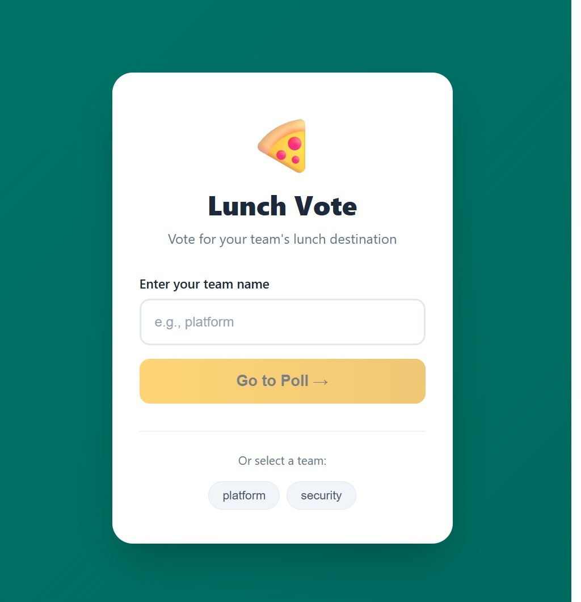
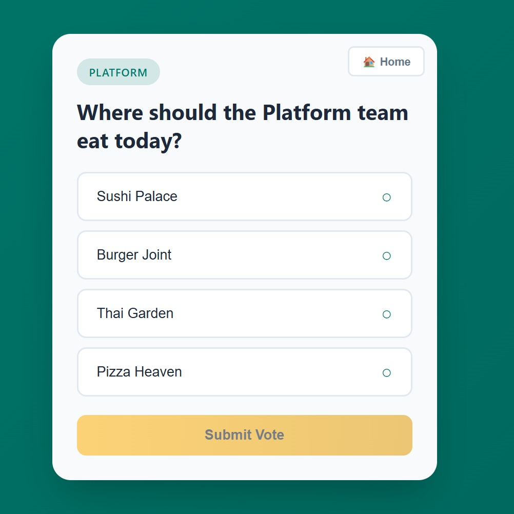
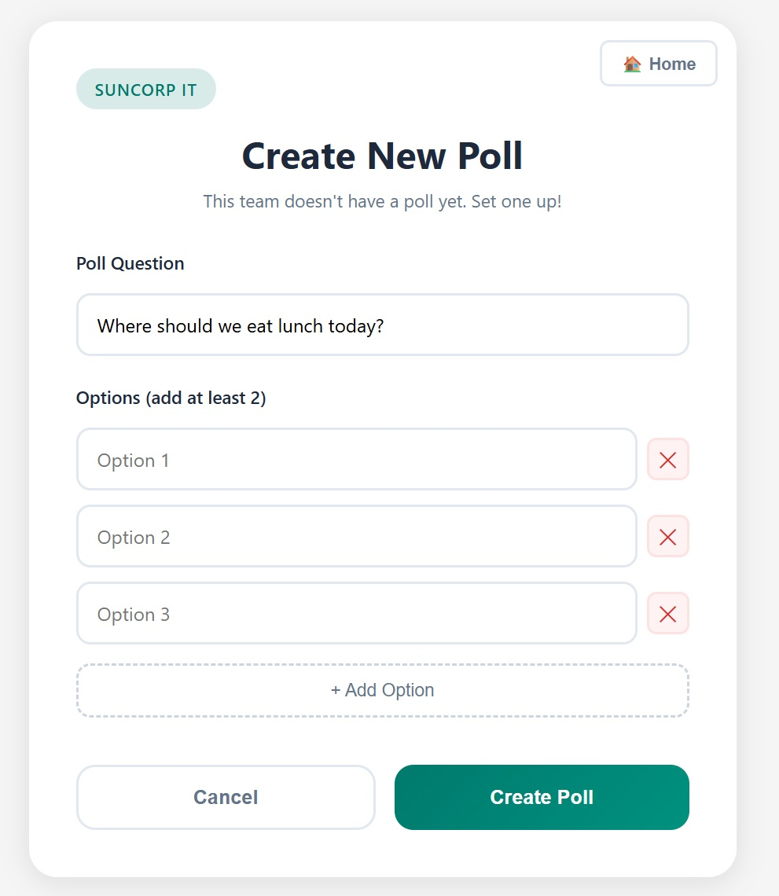

# Challenge 2: 🎨 The Frontend Forge *(Optional)*

### *"Craft a pixel-perfect voting experience — powered by AI"*

**Duration:** ~60 minutes

[⬅ Back to Hackathon Participant Guide](../HACKATHON_PARTICIPANT_GUIDE.md)

---

> 💡 **This challenge is optional.** If you'd prefer to focus on infrastructure and deployment, you can skip building the frontend from scratch and use the **pre-built SPA** provided in `src/lunch-vote-spa/`. Simply run `npm install && npm run dev` to start it locally. If you do choose this challenge, follow the prompts below to build the full app with GitHub Copilot.

### ⚠️ Before You Begin — Workspace Preparation

This repository contains a **complete React + TypeScript SPA** in `src/lunch-vote-spa/`. If this folder remains in your workspace, GitHub Copilot will use it as context and may simply reproduce the existing components, styles, and service code rather than helping you build your own.

**If you are attempting this challenge, delete or move the existing SPA folder outside the workspace before starting:**

---

### Synopsis

The backend API is ready and waiting. Now it's time to give it a face. In this challenge, you'll build a **React + TypeScript** single-page application (SPA) from scratch using **Vite** as your build tool and **GitHub Copilot** as your AI pair-programmer. Your SPA will let users browse teams, create polls, cast votes, and view live results.

### What You'll Learn

#### React & Component-Based Architecture
**React** is a JavaScript library for building user interfaces using reusable **components**. Each component manages its own state and renders a piece of the UI. Components compose together like building blocks to create complex interfaces. In this challenge, you'll build components for the home screen, voting screen, poll creation, and results display.

#### TypeScript
TypeScript adds **static typing** to JavaScript, catching bugs at compile time rather than runtime. You'll define **interfaces** for your API data models (polls, votes, options, results), ensuring type safety throughout your application.

#### Vite
**Vite** (French for "fast") is a modern frontend build tool that offers lightning-fast development server startup and hot module replacement (HMR). Unlike traditional bundlers, Vite serves source files directly using native ES modules, making development incredibly responsive.

#### React Router
For client-side navigation between screens (home → voting → results), you'll use **React Router**, which maps URL paths to React components without full page reloads.

#### SPA Architecture
A **Single-Page Application** loads once and dynamically updates content as the user navigates. This creates a fluid, app-like experience. The SPA communicates with the backend API via HTTP requests (fetch/axios), sending JSON payloads and receiving JSON responses.

### Your Mission

Using GitHub Copilot, create a React + TypeScript SPA that integrates with the provided Lunch Vote API. The API is already running locally at `https://localhost:52544` with mock data.

> ⚠️ **Important:** You must build your own frontend with the assistance of GitHub Copilot. Do NOT copy from the provided `src/lunch-vote-spa/` reference. Let Copilot help you scaffold components, write API service functions, and style the interface.

### Application Screens to Build

1. **Home Screen** — Enter or select a team/group name to navigate to their poll
2. **Vote Screen** — View the active poll for a group, select an option, and submit a vote
3. **Create Poll Screen** — Create a new poll when no active poll exists for a group
4. **Results Screen** — View vote counts and percentages as a bar chart or visual display

### 🤖 GitHub Copilot Skill Focus: Specification-Driven Development with Prompt Files

This challenge introduces **Prompt Files** — reusable Markdown specifications stored in `.github/prompts/` that you invoke as slash commands in Copilot Chat. Instead of typing ad-hoc prompts, you write specifications once and run them repeatedly to generate consistent, high-quality code.

#### Step-by-Step: Create Your Prompt Files

**1. Create the prompts directory:**
```powershell
mkdir -p .github/prompts
```

**2. Scaffold the project** — `.github/prompts/scaffold-react-app.prompt.md`:
```markdown
---
name: scaffold-react-app
description: Scaffold a React + TypeScript SPA with Vite
---

Scaffold a new React + TypeScript project using Vite in `src/lunch-vote-spa/`.

## Requirements
- Use React 18+ with TypeScript 5+ (strict mode enabled)
- Install `react-router-dom` for client-side routing
- Configure Vite:
  - Dev server on port 5173
  - Proxy `/api` requests to `https://localhost:52544` (changeOrigin: true, secure: false)
  - Path alias `@` → `./src`
- Create a `.env.example` file with `VITE_API_URL=/api`

## Route Structure (in App.tsx using BrowserRouter)
- `/` → `<Home />` component
- `/group/:groupId` → `<VoteScreen />` component
- `/group/:groupId/create` → `<CreatePollScreen />` component
- `/poll/:pollId/results` → `<ResultsScreen />` component

## Global Styles (App.css)
Define CSS custom properties on `:root` for a themed design:
- Primary: teal (#007A6D), gold (#FFB81C), red (#E31837)
- Neutral: white (#FFFFFF), light gray (#F5F5F5), gray (#6B7280), text (#1F2937)
- Global reset (box-sizing: border-box), system font stack, light gray background.

## Project Structure

src/lunch-vote-spa/
├── index.html
├── package.json
├── vite.config.ts
├── tsconfig.json
├── .env.example
└── src/
    ├── main.tsx          # ReactDOM.createRoot, StrictMode
    ├── App.tsx           # BrowserRouter + Routes
    ├── App.css           # CSS custom properties + global reset
    ├── components/       # One file per component + matching .css
    ├── services/         # API client + voter token
    └── types/            # TypeScript interfaces (index.ts)

```

**3. Generate the API service layer** — `.github/prompts/generate-api-layer.prompt.md`:
```markdown
---
name: generate-api-layer
description: Generate TypeScript types, API service, and voter token for Lunch Vote App
---

Generate the complete API integration layer for the Lunch Vote SPA.

## 1. Type Definitions — `src/lunch-vote-spa/src/types/index.ts`

Export these TypeScript interfaces:

| Interface | Fields |
|-----------|--------|
| `ActivePoll` | `pollId: string`, `groupId: string`, `question: string`, `options: PollOption[]` |
| `PollOption` | `optionId: string`, `text: string` |
| `VoteRequest` | `pollId: string`, `optionId: string`, `voterToken: string` |
| `PollResults` | `pollId: string`, `question: string`, `results: OptionResult[]`, `totalVotes: number` |
| `OptionResult` | `optionId: string`, `text: string`, `count: number` |
| `ApiError` | `error: string`, `message: string` |
| `VoteResponse` | `message: string` |

## 2. API Service — `src/lunch-vote-spa/src/services/api.ts`

| Method | Endpoint | Returns |
|--------|----------|---------|
| `getActivePoll(groupId)` | `GET /api/polls/active?groupId={encoded}` | `ActivePoll` |
| `submitVote(request: VoteRequest)` | `POST /api/votes` (JSON body) | `VoteResponse` |
| `getPollResults(pollId)` | `GET /api/polls/{pollId}/results` | `PollResults` |
| `createPoll(groupId, question, options: string[])` | `POST /api/polls` (JSON body: `{groupId, question, options}`) | `{ pollId: string }` |
| `getAllGroups()` | `GET /api/groups` | `string[]` |

Requirements:
- Base URL: `import.meta.env.VITE_API_URL || '/api'`
- Use the Fetch API (no axios)
- Create a custom `ApiRequestError` class extending `Error` with `error: string`, `statusCode: number`
- Create a generic `handleResponse<T>(response: Response)` helper that parses error JSON on non-ok responses and throws `ApiRequestError`
- URL-encode the `groupId` parameter in `getActivePoll`

## 3. Voter Token Service — `src/lunch-vote-spa/src/services/voterToken.ts`

- `getOrCreateVoterToken()`: reads from `localStorage` key `'voterToken'`; if missing, generates a UUID via `crypto.randomUUID()`, stores it, and returns it
- `clearVoterToken()`: removes the key from `localStorage`
```

**4. Build the Home screen** — `.github/prompts/build-home-screen.prompt.md`:
```markdown
---
name: build-home-screen
description: Build the Home screen component for the Lunch Vote App
---

Create `src/lunch-vote-spa/src/components/Home.tsx` and `Home.css`.

## Behaviour
- On mount, fetch available groups via `getAllGroups()` from [api.ts](../../src/lunch-vote-spa/src/services/api.ts)
- Re-fetch groups on window `focus` event and on route change (via `useLocation`)
- If `getAllGroups()` fails, fall back to `['platform', 'security', 'apps', 'data']`

## UI Layout
1. **Full-screen centred card** on a teal gradient background
2. **Header**: 🍕 emoji (large), title "Lunch Vote", subtitle "Vote with your team on where to eat!"
3. **Form**: text input for team name (maxLength 50) + "Go to Poll →" button (disabled when empty)
   - On submit, navigate to `/group/<groupId.trim().toLowerCase()>`
4. **Active Teams section**: render each group as a clickable pill/chip button
   - Clicking a chip navigates to `/group/<group>`
   - Show "No teams yet — create a poll to get started!" if the array is empty

## Styling
- Card: white background, 24px border-radius, max-width 400px, box shadow
- Button ("Go to Poll"): gold gradient, hover lift effect, white text
- Group chips: rounded pill shape, teal outline, hover fill
- Use the CSS custom properties from App.css (--suncorp-teal, --suncorp-gold, etc.)

## Hooks Used
`useState`, `useEffect`, `useNavigate`, `useLocation` (from react-router-dom)
```

**5. Build the voting and poll creation screens** — `.github/prompts/build-voting-screens.prompt.md`:
```markdown
---
name: build-voting-screens
description: Build the Vote and Create Poll screens with shared UI components
---

Create the following components in `src/lunch-vote-spa/src/components/`, each with a matching `.css` file.

## Shared Components

### OptionCard (OptionCard.tsx)
Props: `{ option: PollOption, isSelected: boolean, onSelect: (optionId: string) => void, disabled?: boolean }`
- Renders as a `<button>` — flexbox row with option text on left, indicator on right (✓ when selected, ○ when not)
- Selected state: gold border + gold tint, gold indicator
- Hover state: teal border + light teal background (unless disabled)
- Disabled: reduced opacity, not-allowed cursor

### LoadingSpinner (LoadingSpinner.tsx)
Props: `{ message?: string }` (default: `'Loading...'`)
- 48px spinning circle (CSS `@keyframes spin` animation, border-top coloured)
- Message text below the spinner

### ErrorMessage (ErrorMessage.tsx)
Props: `{ title?: string, message: string, onRetry?: () => void }`
- ⚠️ warning icon (3rem), red title (default: 'Error'), gray message text
- Optional blue "Try Again" button that calls `onRetry`

## VoteScreen (VoteScreen.tsx)
Route: `/group/:groupId` — uses `useParams` to get `groupId`.

### State
`poll`, `selectedOptionId`, `isLoading`, `isSubmitting`, `error`, `hasVoted`, `alreadyVoted`, `votedOptionId`, `results`

### Behaviour
1. On mount: call `getActivePoll(groupId)`. If 404 → navigate to `/group/<groupId>/create`.
2. Show `<LoadingSpinner message="Loading poll..." />` while loading.
3. Show `<ErrorMessage>` with retry on error.
4. **Voting view**: display group badge (teal pill, uppercase), poll question, list of `<OptionCard>` components, "Submit Vote" gold button (disabled while submitting)
5. On vote submit: call `submitVote({ pollId, optionId, voterToken })` using `getOrCreateVoterToken()`. On success, fetch results via `getPollResults()`.
6. If the API returns `AlreadyVoted` error: set `alreadyVoted = true`, fetch and show results.
7. **Post-vote view** (shown after voting or if already voted):
   - Emoji: 🎉 for first vote, ✅ for already voted
   - Poll question, total votes count
   - For each option: render a `<ResultBar>` with percentage = `Math.round((count / totalVotes) * 100)`
   - **Winner detection**: find the option(s) with the highest count, mark as winner (handles ties)
   - Highlight the user's voted option in blue
   - Show "Your vote: <option text>" indicator
8. 🏠 home button in top-right corner of card, navigates to `/`

### Styling
- Teal gradient background, white card (max-width 500px, 24px border-radius)
- Submit button: gold gradient, uppercase text

## CreatePollScreen (CreatePollScreen.tsx)
Route: `/group/:groupId/create` — uses `useParams` to get `groupId`.

### State
`question` (default: `"Where should we eat lunch today?"`), `options` (initialized `['', '', '']`), `isCreating`, `error`

### Behaviour
1. Form with question input (maxLength 200) and dynamic list of option inputs (maxLength 100 each)
2. Each option has a ✕ remove button (only shown if there are >2 options)
3. "Add Option" button (dashed border) — max 10 options
4. Validation: at least 2 non-empty options and non-empty question
5. On submit: call `createPoll(groupId, question.trim(), validOptions)`. On success → navigate to `/group/<groupId>`.
6. Show `<LoadingSpinner message="Creating poll..." />` while creating
7. Cancel button → navigates to `/`

### Styling
- White card, max-width 600px, 24px border-radius
- Create button: teal gradient
- Remove option button: red themed
- Add option button: dashed border, teal on hover
```

**6. Build the Results screen** — `.github/prompts/build-results-screen.prompt.md`:
```markdown
---
name: build-results-screen
description: Build the Results screen with auto-refresh and animated result bars
---

Create the following components in `src/lunch-vote-spa/src/components/`, each with a matching `.css` file.

## ResultBar (ResultBar.tsx)
Props: `{ text: string, count: number, percentage: number, isWinner: boolean, highlight?: boolean }`

- Horizontal bar with header row (option text + count/percentage) and animated fill track
- Fill width = `percentage%` with `transition: width 0.5s ease-out`
- Default fill: teal gradient
- Winner: 🏆 badge, gold border + gold background tint, gold gradient fill
- Highlight (user's vote): ✓ icon, blue border + blue background tint
- Count text: format as `"{count} vote(s) ({percentage}%)"` (pluralize "vote"/"votes")
- Container: white background, 12px border-radius, 2px border
- Track: 24px height, light gray background

## ResultsScreen (ResultsScreen.tsx)
Route: `/poll/:pollId/results` — uses `useParams` to get `pollId`.

### State
`results`, `isLoading`, `error`, `lastUpdated`

### Behaviour
1. On mount: call `getPollResults(pollId)` with loading spinner
2. **Auto-refresh every 10 seconds** — silently re-fetches results without showing the loading spinner. Update `lastUpdated` timestamp on each refresh.
3. Winner detection: find all option(s) with the highest count (handles ties)
4. Percentage calculation: `Math.round((result.count / results.totalVotes) * 100)`

### UI Layout
1. Poll question as title
2. List of `<ResultBar>` components for each option
3. Summary bar: total votes count + "Last updated: {time}" via `toLocaleTimeString()`
4. Action buttons: "🔄 Refresh" (teal) + "← Back" (gray, calls `navigate(-1)`)

### Styling
- Teal gradient background, card with max-width 600px, #f8fafc background, 24px border-radius
- Responsive: smaller padding at viewport < 480px

## Hooks Used
`useState`, `useEffect`, `useCallback`, `useParams`, `useNavigate` (from react-router-dom)
```

**7. Run your prompt files in sequence:**

Once you've created all the prompt files above, run them in order in Copilot Chat:

1. Type `/scaffold-react-app` — scaffolds the project, installs dependencies, sets up routing and global styles
2. Type `/generate-api-layer` — generates TypeScript interfaces, API service, and voter token service
3. Type `/build-home-screen` — builds the Home screen component
4. Type `/build-voting-screens` — builds VoteScreen, CreatePollScreen, and shared components (OptionCard, LoadingSpinner, ErrorMessage)
5. Type `/build-results-screen` — builds ResultsScreen and ResultBar with auto-refresh

After each prompt, review the generated code, then move to the next. You can iterate on any component by asking follow-up questions in the same chat session.

> 💡 **Why Prompt Files?** They turn one-off prompts into **repeatable, shareable specifications**. Your team can commit them to Git, iterate on them, and ensure consistent, high-quality AI output across the group.

#### Alternative Copilot Techniques for Frontend Development

- **Plan agent first**: Start with the **Plan** agent: *"Plan the component architecture for a voting SPA with 4 screens"*. Review the plan, then click **Start Implementation** to hand off to Agent mode
- **Vision (image context)**: We've provided UI mockup images in the `challenges/` folder. Drag any of these into the Copilot Chat view and ask Copilot to build the screen as a React component:

  | Mockup | File | Prompt Example |
  |--------|------|----------------|
  | 🏠 Home Screen |  | *"Build this Home screen as a React component"* |
  | 🗳️ Vote / Submission Screen |  | *"Build this voting screen as a React component"* |
  | 📝 Poll Creation Screen |  | *"Build this poll creation form as a React component"* |

  Simply drag the image into Chat, or attach it with `#file:challenges/homescreen.jpg`, and ask: *"Build this screen as a React component matching this mockup"*
- **Inline Chat (`Ctrl+I`)**: Select a component in the editor and press `Ctrl+I` to ask for modifications: *"Add loading spinner and error state to this component"*
- **`/tests`**: Select a component or service file, then type `/tests` to auto-generate unit tests
- **Context with `#`**: Type `#types/index.ts` in chat to reference your TypeScript interfaces when asking Copilot to build components that use them

### Acceptance Criteria

| # | Criteria | Details |
|---|----------|---------|
| ✅ 1 | **Project setup** | A new React + TypeScript project created with Vite in `src/lunch-vote-spa/` (or your own directory), with `react-router-dom` installed |
| ✅ 2 | **Type definitions** | TypeScript interfaces defined for: `ActivePoll`, `PollOption`, `VoteRequest`, `PollResults`, `OptionResult`, `ApiError`, `VoteResponse` |
| ✅ 3 | **API service layer** | A service module that communicates with all 5 API endpoints (`POST /polls`, `GET /polls/active`, `GET /polls/{id}/results`, `POST /votes`, `GET /groups`) with proper error handling |
| ✅ 4 | **Home screen** | Users can enter a group name OR select from a list of active groups fetched from `GET /api/groups` |
| ✅ 5 | **Vote screen** | Displays the active poll question and options; users can select one option and submit their vote. Handles "no active poll" by redirecting to poll creation |
| ✅ 6 | **Create poll screen** | Users can enter a question and multiple options to create a new poll for their group |
| ✅ 7 | **Results screen** | Displays vote counts per option, percentage bars, and total votes with auto-refresh |
| ✅ 8 | **Voter token** | Generates a unique browser token (stored in `localStorage` via `crypto.randomUUID()`) to prevent duplicate voting |
| ✅ 9 | **Error handling** | API errors are displayed to the user with meaningful messages (e.g., "You've already voted") using a reusable ErrorMessage component |
| ✅ 10 | **Routing** | Client-side routing works: `/` (home), `/group/:groupId` (vote), `/group/:groupId/create` (create poll), `/poll/:pollId/results` (results) |
| ✅ 11 | **Runs locally** | `npm run dev` starts the app, and it successfully communicates with the local API |
| ✅ 12 | **GitHub Copilot** | Demonstrate that GitHub Copilot assisted in building the frontend (show chat history or inline suggestions) |

### GitHub Copilot Tips for This Challenge

- Use your **Prompt Files** to scaffold the project, generate the API service layer, and create components consistently
- Start with the **Plan** agent to design the component architecture before implementing
- Use **Vision** by dragging the provided mockup images (`challenges/homescreen.jpg`, `challenges/votesubmissionscreen.jpg`, `challenges/pollcreationscreen.jpg`) into chat for UI generation
- Use **Inline Chat** (`Ctrl+I`) to refine individual components after generation
- Ask Copilot to help with CSS styling: *"Style this component with a modern card-based layout using CSS flexbox"*
- Use `/tests` on your service layer to generate unit tests
- Use `#codebase` in your prompts so Copilot understands your project structure
